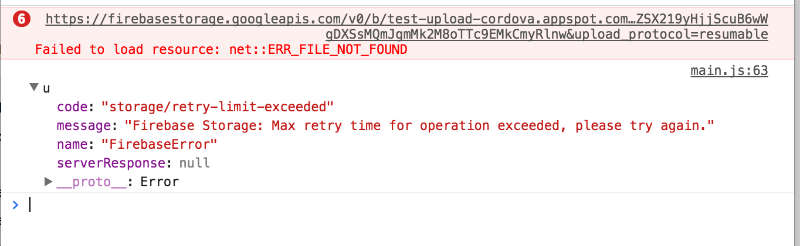
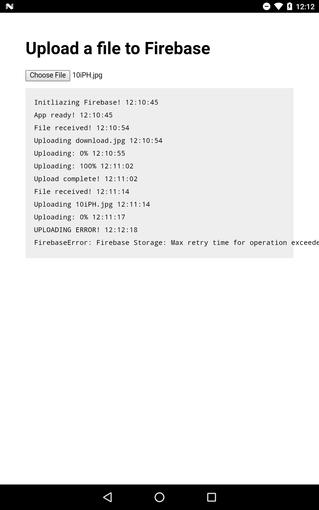

This is a Cordova test project to reproduce a bug when uploading files to Firebase using the WEB SDK on Android with an `<input type="file">`.

### Reproducing the error

There is an `.apk` file in `./FirebaseUpload/platforms/android/build/outputs/apk/android-debug.apk`.

To remote debug:

1. Connect device via USB and make sure developer mode + debugging is enabled
2. Open Chrome dev tools and select `More tools > Remote devices`.
3. Select your device on the left, and inspect the webview.

To try this on a browser simply open `FirebaseUpload/www/index.html` in your browser.

To compile the `.apk` file:

1. Install Android SDK and Cordova with `sudo npm install -g cordova`
2. `cd FirebaseUpload`
3. `cordova build android --debug`

To compile and run the `.apk` on a connected device:

1. Install Android SDK and Cordova with `sudo npm install -g cordova`
2. `cd FirebaseUpload`
3. `cordova run android --device`

### More about the error

The problem only occurs when the selected file is on Google drive. When selecting a file from the downloads folder it works fine. Also, when uploading a file from Drive using the browser it works fine. It seems the problem is a combination between the Firebase API, and Google Drive.

When remote debugging with Chrome the error message is:
```
https://firebasestorage.googleapis.com/v0/b/test-upload-cordova.appspot.com…sbj4wEloO4Dffkf2_YAP8jQukZwSjyM4W4-C69Znqu6c92MA&upload_protocol=resumable
Failed to load resource: net::ERR_FILE_NOT_FOUND
```

After a few tries a new error appears:

```
code: "storage/retry-limit-exceeded"
message: "Firebase Storage: Max retry time for operation exceeded, please try again."
```





